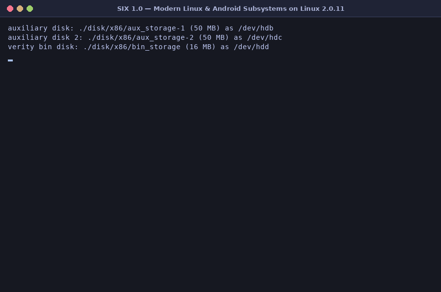

# SIX — Modern Linux & Android Subsystems on a User-Mode Linux 2.0.11 Kernel

**SIX** is an active, self-contained operating system environment that runs entirely as an unprivileged user-space process on modern Linux hosts.

While SIX originally began in the early 2000s as a Solaris port of User Mode Linux 2.0.11, it is **not** a legacy preservation project. Instead, SIX is an evolving hybrid system that grafts **modern Linux kernel subsystems** and **contemporary Android platform architecture** onto a compact, fast-booting Linux 2.0.11 foundation—complete with its own C library, self-hosting compiler toolchain, storage stack, IPC fabric, and interactive userland.

New modern Linux and Android capabilities are continuously being designed, ported, and integrated.

<p align="center">
  
</p>

---

## What SIX Does

When you run `./six`, the entire operating system boots in under a second inside a single host process:

* **Virtual Physical Memory & Context Switching**: SIX allocates a backing RAM file and manages virtual memory mappings, task switching, and preemptive timer interrupts entirely in user space without requiring root privileges, KVM, or kernel modules on the host.
* **Multi-Tier Storage Hierarchy**: Bootstraps a multi-disk storage topology spanning `ext4`, `EROFS` over `dm-verity`, `OverlayFS`, `NTFS-3G` over `FUSE`, `Device-Mapper` (`dm-linear` and `dm-crypt`), `NVMe`, `UFS`, and hotpluggable USB mass storage.
* **Android & Unix Daemons**: Launches a full suite of background services at boot—including Android's `servicemanager`, `vold`, `storaged`, `mediaproviderd`, `externalstoraged`, and `sadbd`, alongside `khungtaskd`, `httpd`, and `telnetd`.

---

## Android Platform Features

SIX implements a growing slice of the modern Android system architecture, allowing Android daemons, Binder services, and desktop-style utilities to run natively on top of the kernel:

* **Binder IPC & Service Management**: Kernel `/dev/binder` driver, context manager (`servicemanager`), standardized AIDL interface definitions, and CLI introspection via `service` and `dumpsys`.
* **Storage Architecture (`vold` & `storaged`)**:
  * Native C++ Volume Daemon (`vold`) and `StorageManagerService` (`storaged` + `sm` CLI).
  * Dynamic `/etc/fstab` `DiskSource` parsing and simulated USB mass-storage hotplug (`usbctl`) supporting `ext2`, `ext4`, `NTFS`, and `EROFS`.
  * **Public & Adoptable Storage**: Full support for public portable volumes as well as encrypted adoptable private storage (`sm partition <disk> private`) backed by `dm-crypt` and `ext4`.
* **Scoped Storage, MediaProvider & Storage Access Framework**:
  * **`MediaProvider` (`mediaproviderd`)**: FUSE-backed (`/dev/fuse`) upper filesystem mounted at `/storage/emulated/0` and `/storage/<UUID>`, enforcing per-UID Scoped Storage sandboxes (`Android/data/<pkg>`), indexed media collections, and automatic on-the-fly **EXIF GPS metadata redaction** for unprivileged readers.
  * **`ExternalStorageProvider` (`externalstoraged`)**: Standalone Storage Access Framework (`IDocumentsProvider`) Binder daemon serving document roots, directory trees, and document CRUD operations over `content://com.android.externalstorage.documents`.
  * **`content` CLI & Android Desktop `files` App**: Query and mutate providers from the shell via `content`, or browse volumes interactively in the curses-based Android Desktop **Files** application (`files`) with a live Scoped Storage Inspector, USB hotplug auto-refresh, and dynamic full-terminal resizing.
* **Android Power Management & Opportunistic Suspend**:
  * `/sys/power/state`, `/sys/power/wake_lock`, `/sys/power/wake_unlock`, `/sys/power/wakeup_count`, `/sys/power/suspend_stats`, `/sys/power/wakealarm`, and `/proc/wakelocks`.
  * `IPowerManager` and `ISystemSuspend` Binder services with `/bin/power` CLI, process freezer (`__refrigerator`) with D-state task abort/retry, gated 0%-CPU deep sleep, and monotonic vs. boottime clock tracking.
* **SIX Android Debug Bridge (`sadb`)**:
  * Host-to-guest `./sadb` client and in-guest `sadbd` daemon over `/dev/sadb`.
  * Supports `sadb devices -l`, interactive PTY `sadb shell` (with full terminal size propagation and signal handling), `sadb push`, `sadb pull`, and one-command remote source-level debugging (`sadb gdb`).

---

## Modern Linux Kernel & Userspace Features

Alongside its Android stack, SIX brings modern Linux filesystems, block drivers, hardware management protocols, and kernel observability primitives to the 2.0.11 base:

* **Modern Filesystems**:
  * **`ext4`**: Extent-based root and userdata filesystems with `ext4info` superblock/extent inspection.
  * **`EROFS`**: Read-only filesystem driver used for `/bin` and portable USB media.
  * **`OverlayFS`**: Union filesystem stacking a writable upper layer (`/var/overlay/bin`) over the read-only `dm-verity` `/bin` image with transparent copy-up and whiteouts.
  * **`FUSE` & `NTFS-3G`**: Kernel FUSE 7.x character/vfs driver running upstream `ntfs-3g` (in both direct block path mode and privileged `vold` file-descriptor-passing mode) plus the full 12-tool `ntfsprogs` suite (`mkntfs`, `ntfsfix`, `ntfsinfo`, `ntfslabel`, `ntfsls`, `ntfscat`, `ntfscluster`, `ntfscmp`, `ntfscp`, `ntfsresize`, `ntfsclone`, `ntfsundelete`).
  * **`tmpfs` & `procfs`**: In-memory `/tmp` filesystem and comprehensive `/proc` process, mount, device, and kernel telemetry.
* **Device-Mapper (`dm`)**:
  * `dm-linear` target for logical volume concatenation/striping.
  * `dm-crypt` target with 256-bit **ChaCha20** stream cipher encryption.
  * `dm-verity` target enforcing **SHA-256 Merkle tree** block integrity verification on `/bin`.
  * Managed via `dmsetup` and visualized in tree format by `lsblk`.
* **NVMe 1.4 & JEDEC UFS 4.0 Storage Controllers**:
  * **NVMe 1.4 (`/dev/nvme0`, `/dev/nvme0n1`)**: Admin and I/O Submission/Completion Queue rings, Identify Controller/Namespace, SMART/Health log pages, Flush, Dataset Management (`DSM` / `TRIM`), dual firmware slots, and `/bin/nvme` CLI.
  * **JEDEC UFS 4.0 (`/dev/ufs-bsg0`, `/dev/ufsa..c`, `/dev/ufs-rpmb`)**: UFSHCI 4.0 controller with multi-LUN storage (`/ufs`), switchable A/B boot LUNs, SLC WriteBooster, SCSI `UNMAP`, **HMAC-SHA256 authenticated RPMB** (Replay Protected Memory Block) for anti-rollback counters, and `/bin/ufs` CLI.
* **Firmware Update Manager (`fwupdmgr`)**:
  * LVFS metadata refresh, Microsoft Cabinet (`.cab` with `MSZIP` decompression) and raw `.bin` firmware archive inspection, cryptographic signature verification, and live Field Firmware Updates (FFU) across `nvme`, `ufs`, and `scsi` plugins with persistent state across reboots.
* **Kernel Watchdogs, Crash Persistence & Diagnostics**:
  * **`khungtaskd`**: Hung-task detector monitoring `TASK_UNINTERRUPTIBLE` (`D`-state) processes with blocker attribution and configurable `kernel.hung_task_*` sysctls.
  * **Block Queue Stall Watchdog**: Detects and dumps stalled in-flight block I/O requests (`kernel.blk_io_timeout_ms` and `/sys/fs/hangman`).
  * **`pstore` (`ramoops`)**: Crash dump persistence writing `dmesg-ramoops-0` and `ftrace-ramoops-0` syscall traces to `/sys/fs/pstore` on kernel panic or snapshot (`panic -s`).
  * **Configurable `sys_info` Dumps**: Bitmask-controlled task, memory, timer, lock, ftrace, and all-CPU backtrace dumps (`kernel.panic_print`, `kernel.panic_sys_info`, `kernel.hung_task_sys_info`, `kernel.kernel_sys_info`).
* **Self-Hosting Compiler, Threads & Source-Level Debugger**:
  * In-guest **TinyCC (`tcc`)** C compiler capable of compiling and linking ELF executables inside the running guest.
  * Preemptive **POSIX Threads (`pthread`)** built on `clone()`.
  * Full `ptrace` support powering both **`strace`** (child spawn, `-p <pid>` live attach, and `-c` syscall profiling) and source-level **`gdb`** (DWARF/`.stab` line debugging, breakpoints, single-stepping, backtraces, disassembly, and live PID attach).

---

## Feature Summary: Modern Meets Classic

| Category | Available Features & Utilities |
| :--- | :--- |
| **Android Stack** | `servicemanager`, `service`, `dumpsys`, `vold`, `storaged`, `sm`, `usbctl`, `mediaproviderd`, `externalstoraged`, `content`, `files` (Desktop UI), `power` (`IPowerManager` / `ISystemSuspend`), `sadbd` & host `./sadb` |
| **Modern Storage & Filesystems** | `ext4` (`ext4info`), `erofs`, `overlayfs`, `fuse`, `ntfs-3g` + 12 `ntfsprogs` tools, `tmpfs`, `dm-linear`, `dm-crypt` (ChaCha20-256), `dm-verity` (SHA-256), `dmsetup`, `lsblk`, `mkfs.ext2` (`mke2fs`), `mount` / `umount` (`/etc/fstab`) |
| **Hardware & Firmware** | `nvme` (NVMe 1.4 controller/namespaces), `ufs` (JEDEC UFS 4.0 multi-LUN, A/B boot slots, WriteBooster, HMAC-SHA256 RPMB), `fwupdmgr` / `fwupdtool` (LVFS `.cab` & `.bin` firmware updates for NVMe, UFS, SCSI) |
| **Kernel Reliability & Debug** | `gdb` (DWARF source-level & live PID attach), `strace` (`-p` attach, `-c` summary), `tcc` (in-guest C compiler + `pthread`), `khungtaskd`, `blk-mq` stall watchdog (`/sys/fs/hangman`), `pstore` (`/sys/fs/pstore`), `panic`, `sysctl`, `dmesg`, `lsof`, `top` |
| **Networking & Multi-User** | Loopback & host-bridged TCP/IP, `ifconfig`, `httpd`, `telnetd` + `telnet` (with PTY login), `lynx`, `gopher`, `irc`, `mail` (local mbox & SMTP), `weather` (live Open-Meteo client), `nettest`, `useradd`, `usermod`, `userdel`, `passwd`, `su`, `chown`, `who`, `whoami` |
| **Classic Unix & Retro Games** | Bourne shell (`sh` with job control `Ctrl+Z`/`jobs`/`fg`/`bg`, `set -o vi`, aliases, history search & `!!` expansion), `vi` (`elvis`), `awk`, `sed`, `grep`, `find`, `tar`, `sort`, `uniq`, `tr`, `cut`, `diff`, `xargs`, `hexdump`, `file`, `nm`, `size`, `strings`, `stat`, `du`, `df`, `ps` (SysV & BSD tree modes), `basic`, `advent`, `zork`, `rogue`, `robots`, `trek`, `tetris`, `reversi`, `gomoku`, `life`, `ttt`, `eliza`, `fortune`, `cowsay`, `matrix`, `starwars`, `telehack`, `sixanim`, `dhrystone` |

---

## Building, Running & Testing

### 1. Prerequisites (Debian / Ubuntu / gLinux)
```bash
sudo apt-get install build-essential gcc-multilib g++-multilib e2fsprogs erofs-utils fakeroot python3
```

### 2. Build Everything
A single `make` builds the kernel, the guest C/C++ libraries, all guest daemons and applications, the `dm-verity` `EROFS` `/bin` image, the `ext4` root and userdata images, the `UFS` multi-LUN flash image, and the host `./sadb` bridge:

```bash
make -j8
```

### 3. Boot SIX Interactively
```bash
./six
```
* Log in as **`root`** (no password), or switch to unprivileged users (`su six`, `su guest`) to explore Scoped Storage and multi-user permissions.
* From another host terminal, you can interact with the running guest using **`./sadb`**:
  ```bash
  ./sadb devices -l
  ./sadb shell
  ./sadb gdb /bin/servicemanager
  ```
* Run **`halt`** at the guest shell prompt to cleanly unmount filesystems and exit, or press **`Ctrl+\`** at any time for an immediate exit.

### 4. Run the Automated Regression Suite
SIX includes a 34-suite end-to-end regression test runner that exercises the kernel, filesystems, Device-Mapper, Binder services, `vold` USB hotplug, `MediaProvider` / `ExternalStorageProvider`, `Files` UI, `NVMe`, `UFS`, `fwupdmgr`, `gdb`, `strace`, `sadb`, networking, and shell job control:

```bash
./scripts/test_suite.py --parallel
```
